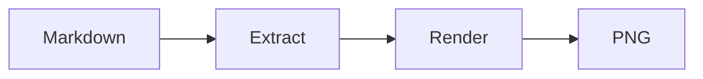

# Sample document

Markdown files can hold several diagrams. Each fenced `mermaid` block becomes
its own PNG (`26_markdown_doc-1.png`, `-2.png`, ...).

## Backtick fence



Some text between the diagrams, including a non-mermaid block that must be ignored:

```python
print("not a diagram")
```

## Tilde fence

~~~mermaid
sequenceDiagram
    Reader->>Converter: README.md
    Converter-->>Reader: three PNG files
~~~

## Indented inside a list

1. First step

   ```mermaid
   pie title Blocks found
       "backtick" : 2
       "tilde" : 1
   ```

2. Second step
